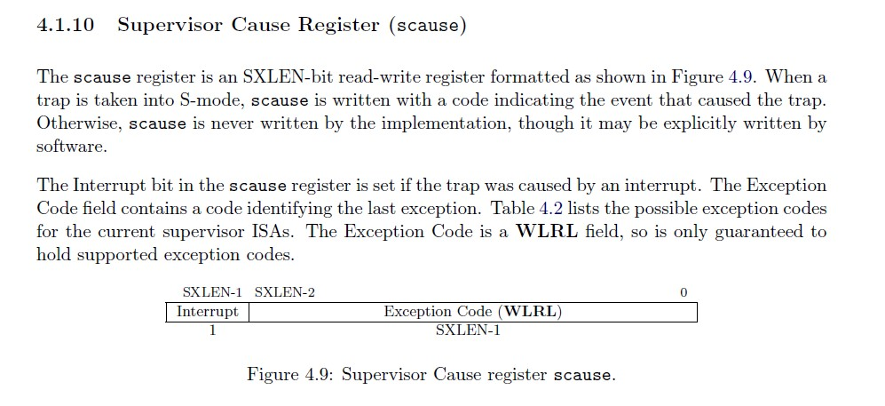
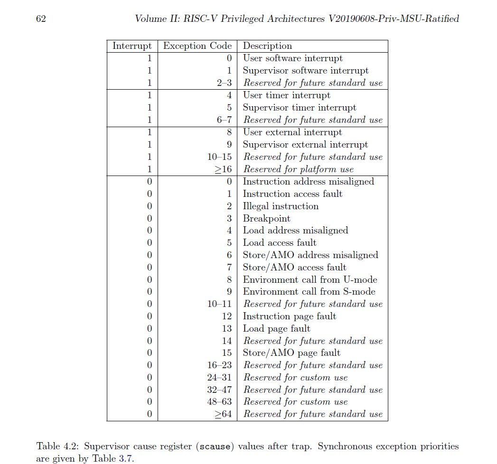

# lab1 2/n 中断处理程序

中断处理需要初始化，所以我们在`init.c`里调用一些初始化的函数

```c
// kern/init/init.c
#include <trap.h>
int kern_init(void) {
    extern char edata[], end[];
    memset(edata, 0, end - edata);

    cons_init();  // init the console

    const char *message = "(THU.CST) os is loading ...\n";
    cprintf("%s\n\n", message);

    print_kerninfo();

    // grade_backtrace();
	
    //trap.h的函数，初始化中断
    idt_init();  // init interrupt descriptor table

    //clock.h的函数，初始化时钟中断
    clock_init();  
	//intr.h的函数，使能中断
    intr_enable();  

    // LAB1: CAHLLENGE 1 If you try to do it, uncomment lab1_switch_test()
    // user/kernel mode switch test
    // lab1_switch_test();
    /* do nothing */
    while (1)
        ;
}
// kern/trap/trap.c
void idt_init(void) {
    extern void __alltraps(void);
    //约定：若中断前处于S态，sscratch为0
    //若中断前处于U态，sscratch存储内核栈地址
    //那么之后就可以通过sscratch的数值判断是内核态产生的中断还是用户态产生的中断
    //我们现在是内核态所以给sscratch置零
    write_csr(sscratch, 0);
    //我们保证__alltraps的地址是四字节对齐的，将__alltraps这个符号的地址直接写到stvec寄存器
    write_csr(stvec, &__alltraps);
}
//kern/driver/intr.c
#include <intr.h>
#include <riscv.h>
/* intr_enable - enable irq interrupt, 设置sstatus的Supervisor中断使能位 */
void intr_enable(void) { set_csr(sstatus, SSTATUS_SIE); }
/* intr_disable - disable irq interrupt */
void intr_disable(void) { clear_csr(sstatus, SSTATUS_SIE); }
```


trap.c的中断处理函数trap, 实际上把中断处理,异常处理的工作分发给了interrupt_handler()，exception_handler(), 这些函数再根据中断或异常的不同类型来处理。

```c
// kern/trap/trap.c
/* trap_dispatch - dispatch based on what type of trap occurred */
static inline void trap_dispatch(struct trapframe *tf) {
    //scause的最高位是1，说明trap是由中断引起的
    if ((intptr_t)tf->cause < 0) {
        // interrupts
        interrupt_handler(tf);
    } else {
        // exceptions
        exception_handler(tf);
    }
}

/* *
 * trap - handles or dispatches an exception/interrupt. if and when trap()
 * returns,
 * the code in kern/trap/trapentry.S restores the old CPU state saved in the
 * trapframe and then uses the iret instruction to return from the exception.
 * */
void trap(struct trapframe *tf) { trap_dispatch(tf); }

```

我们可以看到，interrupt_handler()和exception_handler()的实现还比较简单，只是简单地根据`scause`的数值更仔细地分了下类，做了一些输出就直接返回了。我们接下来主要关注时钟中断的处理。

switch里的各种case, 如`IRQ_U_SOFT`,`CAUSE_USER_ECALL`,是riscv ISA 标准里规定的。我们在`riscv.h`里定义了这些常量。

```c
void interrupt_handler(struct trapframe *tf) {
    intptr_t cause = (tf->cause << 1) >> 1; //抹掉scause最高位代表“这是中断不是异常”的1
    switch (cause) {
        case IRQ_U_SOFT:
            cprintf("User software interrupt\n");
            break;
        case IRQ_S_SOFT:
            cprintf("Supervisor software interrupt\n");
            break;
        case IRQ_H_SOFT:
            cprintf("Hypervisor software interrupt\n");
            break;
        case IRQ_M_SOFT:
            cprintf("Machine software interrupt\n");
            break;
        case IRQ_U_TIMER:
            cprintf("User software interrupt\n");
            break;
        case IRQ_S_TIMER:
            //时钟中断
            clock_set_next_event();
            if (++ticks % TICK_NUM == 0) {
                print_ticks();
            }
            break;
        case IRQ_H_TIMER:
            cprintf("Hypervisor software interrupt\n");
            break;
        case IRQ_M_TIMER:
            cprintf("Machine software interrupt\n");
            break;
        case IRQ_U_EXT:
            cprintf("User software interrupt\n");
            break;
        case IRQ_S_EXT:
            cprintf("Supervisor external interrupt\n");
            break;
        case IRQ_H_EXT:
            cprintf("Hypervisor software interrupt\n");
            break;
        case IRQ_M_EXT:
            cprintf("Machine software interrupt\n");
            break;
        default:
            print_trapframe(tf);
            break;
    }
}

void exception_handler(struct trapframe *tf) {
    switch (tf->cause) {
        case CAUSE_MISALIGNED_FETCH:
            break;
        case CAUSE_FAULT_FETCH:
            break;
        case CAUSE_ILLEGAL_INSTRUCTION:
            break;
        case CAUSE_BREAKPOINT:
            break;
        case CAUSE_MISALIGNED_LOAD:
            break;
        case CAUSE_FAULT_LOAD:
            break;
        case CAUSE_MISALIGNED_STORE:
            break;
        case CAUSE_FAULT_STORE:
            break;
        case CAUSE_USER_ECALL:
            break;
        case CAUSE_SUPERVISOR_ECALL:
            break;
        case CAUSE_HYPERVISOR_ECALL:
            break;
        case CAUSE_MACHINE_ECALL:
            break;
        default:
            print_trapframe(tf);
            break;
    }
}

```

下面是RISCV标准里`scause`的部分，可以看到有个scause的数值与中断/异常原因的对应表格。





