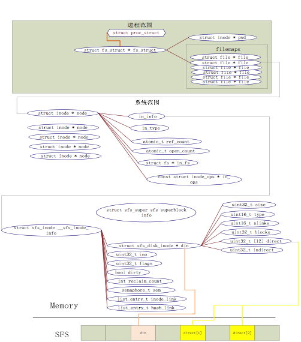

# lab8: 文件系统

我们来到了最后一个lab。**文件系统(file system)**，指的是操作系统中管理（硬盘上）持久存储数据的模块。除了硬盘上的数据，我们还可以把设备（如标准输入，标准输出）看成是文件，由文件系统进行统一的管理。之前我们曾经模拟过一个很简单的文件系统，用来存放内存置换出的页面。现在我们要来实现更加复杂的文件系统。

我们希望实现一个**虚拟文件系统（virtual file system, VFS）**, 作为操作系统和具体的文件系统之间的接口。例如，电脑上本地的硬盘和远程的云盘(例如清华云盘，OneDrive）的具体文件管理方式很可能不同，但是操作系统可以让我们用相同的操作访问这两个地方的文件。

例如，远程的云盘OneDrive，在Windows资源管理器(可以看作是虚拟文件系统提供给用户的接口)里，看起来和本地磁盘上的文件夹一模一样，也可以做和本地的文件夹相同的操作，复制，粘贴，打开。虽然背后有着网络传输，可能速度会慢很多，但是接口是一致的。

我们将用虚拟文件系统管理三类设备：

- 硬盘，我们把管理硬盘的具体文件系统叫做Simple File System
- 标准输出（控制台输出），只能写不能读
- 标准输入（键盘输入），只能读不能写

其中，标准输入和标准输出都是比较简单的设备。管理硬盘的Simple File System相对而言比较复杂。

我们的“硬盘”依然需要通过用一块内存来模拟。

在Makefile里，我们分三段构建内核镜像。

- sfs.img: 一块符合SFS文件系统的硬盘，里面存储编译好的用户程序
- swap.img: 一段初始化为0的交换区
- kernel objects: ucore内核代码的目标文件

这三部分共同组成ucore.img, 加载到QEMU里运行。我们通过链接时添加的首尾符号，把`swap.img`和`sfs.img`两段“硬盘”（实际上对应两段内存空间）找出来，然后作为“硬盘”进行管理。

注意，我们要在ucore内核开始执行之前，构造好“一块符合SFS文件系统的硬盘”，这就得另外写个程序做这个事情。这个程序就是`tools/mksfs.c`。它有500多行，看起来挺长，感兴趣的话可以通过它了解Simple File System的结构。

### ucore 文件系统总体介绍

ucore 的文件系统模型源于 Havard 的 OS161 的文件系统和 Linux 文件系统。但其实这二者都是源于传统的 UNIX 文件系统设计。UNIX 提出了四个文件系统抽象概念：文件(file)、目录项(dentry)、索引节点(inode)和安装点(mount point)。

- 文件：UNIX 文件中的内容可理解为是一有序字节 buffer，文件都有一个方便应用程序识别的文件名称（也称文件路径名）。典型的文件操作有读、写、创建和删除等。
- 目录项：目录项不是目录（又称文件路径），而是目录的组成部分。在 UNIX 中目录被看作一种特定的文件，而目录项是文件路径中的一部分。如一个文件路径名是“/test/testfile”，则包含的目录项为：根目录“/”，目录“test”和文件“testfile”，这三个都是目录项。一般而言，目录项包含目录项的名字（文件名或目录名）和目录项的索引节点（见下面的描述）位置。
- 索引节点：UNIX 将文件的相关元数据信息（如访问控制权限、大小、拥有者、创建时间、数据内容等等信息）存储在一个单独的数据结构中，该结构被称为索引节点。
- 安装点：在 UNIX 中，文件系统被安装在一个特定的文件路径位置，这个位置就是安装点。所有的已安装文件系统都作为根文件系统树中的叶子出现在系统中。

上述抽象概念形成了 UNIX 文件系统的逻辑数据结构，并需要通过一个具体文件系统的架构设计与实现把上述信息映射并储存到磁盘介质上，从而在具体文件系统的磁盘布局（即数据在磁盘上的物理组织）上具体体现出上述抽象概念。比如文件元数据信息存储在磁盘块中的索引节点上。当文件被载入内存时，内核需要使用磁盘块中的索引点来构造内存中的索引节点。

ucore 模仿了 UNIX 的文件系统设计，ucore 的文件系统架构主要由四部分组成：

- 通用文件系统访问接口层：该层提供了一个从用户空间到文件系统的标准访问接口。这一层访问接口让应用程序能够通过一个简单的接口获得 ucore 内核的文件系统服务。
- 文件系统抽象层：向上提供一个一致的接口给内核其他部分（文件系统相关的系统调用实现模块和其他内核功能模块）访问。向下提供一个同样的抽象函数指针列表和数据结构屏蔽不同文件系统的实现细节。
- Simple FS 文件系统层：一个基于索引方式的简单文件系统实例。向上通过各种具体函数实现以对应文件系统抽象层提出的抽象函数。向下访问外设接口
- 外设接口层：向上提供 device 访问接口屏蔽不同硬件细节。向下实现访问各种具体设备驱动的接口，比如 disk 设备接口/串口设备接口/键盘设备接口等。

对照上面的层次我们再大致介绍一下文件系统的访问处理过程，加深对文件系统的总体理解。假如应用程序操作文件（打开/创建/删除/读写），首先需要通过文件系统的通用文件系统访问接口层给用户空间提供的访问接口进入文件系统内部，接着由文件系统抽象层把访问请求转发给某一具体文件系统（比如 SFS 文件系统），具体文件系统（Simple FS 文件系统层）把应用程序的访问请求转化为对磁盘上的 block 的处理请求，并通过外设接口层交给磁盘驱动例程来完成具体的磁盘操作。结合用户态写文件函数 write 的整个执行过程，我们可以比较清楚地看出 ucore 文件系统架构的层次和依赖关系。

**ucore 文件系统总体结构**

从 ucore 操作系统不同的角度来看，ucore 中的文件系统架构包含四类主要的数据结构, 它们分别是：

- 超级块（SuperBlock），它主要从文件系统的全局角度描述特定文件系统的全局信息。它的作用范围是整个 OS 空间。
- 索引节点（inode）：它主要从文件系统的单个文件的角度它描述了文件的各种属性和数据所在位置。它的作用范围是整个 OS 空间。
- 目录项（dentry）：它主要从文件系统的文件路径的角度描述了文件路径中的一个特定的目录项（注：一系列目录项形成目录/文件路径）。它的作用范围是整个 OS 空间。对于 SFS 而言，inode(具体为 struct sfs_disk_inode)对应于物理磁盘上的具体对象，dentry（具体为 struct sfs_disk_entry）是一个内存实体，其中的 ino 成员指向对应的 inode number，另外一个成员是 file name(文件名).
- 文件（file），它主要从进程的角度描述了一个进程在访问文件时需要了解的文件标识，文件读写的位置，文件引用情况等信息。它的作用范围是某一具体进程。

如果一个用户进程打开了一个文件，那么在 ucore 中涉及的相关数据结构和关系如下图所示：

